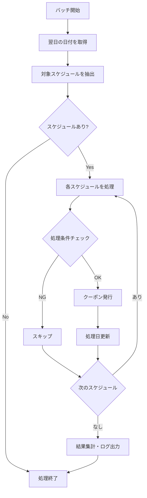

# クーポンスケジュール バッチ処理仕様書

## 概要

クーポンスケジュールに基づいて、自動的にクーポンを発行するバッチ処理システムの仕様書です。

## 目的

- スケジュール設定に基づいた自動クーポン発行
- 00:00～01:00の時間帯をカバーするための翌日分事前作成
- 重複処理の防止
- エラーハンドリングとログ記録

## システム構成

### ファイル構成

```
app/
├── Console/Commands/
│   ├── ProcessCouponSchedules.php    # メインバッチ処理コマンド
│   └── TestCouponSchedules.php       # テスト用コマンド
├── Services/Coupon/
│   └── CouponScheduleBatchService.php # バッチ処理ビジネスロジック
└── Models/
    └── CouponSchedule.php             # スケジュールモデル

routes/
└── console.php                        # スケジュール設定
```

## バッチ処理仕様

### 実行スケジュール

- **実行時間**: 毎日 01:00
- **処理対象**: 翌日分のスケジュール
- **重複実行防止**: `withoutOverlapping()` 使用
- **バックグラウンド実行**: `runInBackground()` 使用

### 処理フロー



## スケジュール抽出条件

### 基本条件

1. **アクティブ状態**: `is_active = true`
2. **有効期間内**: `valid_from <= 対象日 <= valid_until`
3. **曜日条件**: 対象日の曜日がスケジュール設定に合致

### 曜日タイプ別条件

| タイプ | 条件 | 説明 |
|--------|------|------|
| `daily` | 毎日 | 全ての曜日で実行 |
| `weekdays` | 平日のみ | 月曜日～金曜日（1-5） |
| `weekends` | 休日のみ | 土曜日・日曜日（0,6） |
| `custom` | カスタム | `custom_days`配列で指定された曜日 |

### 処理除外条件

1. **クーポン無効**: 関連クーポンが`is_active = false`
2. **処理済み**: `last_batch_processed_date`が対象日と同じ
3. **クーポン不存在**: 関連クーポンが削除済み

## クーポン発行処理

### 発行データ構造

```php
[
    'shop_id' => $schedule->shop_id,
    'issue_type' => 'batch_generated',
    'target_date' => '2024-01-15',
    'start_time' => '2024-01-15 14:00:00',
    'end_time' => '2024-01-15 17:00:00',
    'start_time_only' => '14:00:00',
    'end_time_only' => '17:00:00',
    'max_acquisitions' => 20,
    'current_acquisitions' => 0,
    'status' => 'active',
    'is_active' => true,
    'issued_by' => null,
    'issued_at' => '2024-01-14 01:00:00'
]
```

### 時刻計算ロジック

- **基本**: 対象日 + スケジュール時刻
- **日跨ぎ**: 終了時刻 < 開始時刻の場合、終了時刻を翌日に設定
- **例**: 22:00-02:00 → 22:00-翌日02:00

## コマンド仕様

### 1. メインバッチ処理コマンド

```bash
php artisan coupon:process-schedules [--date=YYYY-MM-DD]
```

#### オプション

- `--date`: 処理対象日（省略時は翌日）

#### 実行例

```bash
# 翌日分を処理
php artisan coupon:process-schedules

# 特定日を処理
php artisan coupon:process-schedules --date=2024-01-15
```

#### 出力例

```
クーポンスケジュール処理を開始します...
処理対象日: 2024-01-15
処理完了:
- 処理対象スケジュール数: 5
- 発行されたクーポン数: 3
- スキップされたスケジュール数: 2
```

### 2. テスト用コマンド

```bash
php artisan coupon:test-schedules [--date=YYYY-MM-DD]
```

#### 特徴

- **非破壊的**: 実際のクーポン発行は行わない
- **詳細表示**: 対象スケジュールの一覧とスキップ理由を表示
- **事前確認**: 本番実行前の動作確認に使用

#### 出力例

```
クーポンスケジュール処理のテストを開始します...
テスト対象日: 2024-01-15 (Monday)
全スケジュール数: 8
対象日に該当するスケジュール数: 3

+------+----------+------------------+------------------+----------+-------------+----------+
| ID   | 店舗     | クーポン名       | スケジュール名   | 曜日タイプ | 時間        | 最終処理日 |
+------+----------+------------------+------------------+----------+-------------+----------+
| 01HW | カフェA  | ドリンク10%OFF   | 平日午後の空席時間 | 平日のみ   | 14:00 - 17:00 | 未処理   |
| 01HX | カフェB  | スイーツ半額     | 休日ティータイム | 土日のみ   | 15:00 - 17:00 | 2024-01-14 |
+------+----------+------------------+------------------+----------+-------------+----------+

実際に処理されるスケジュール数: 2
スキップされるスケジュール:
  - 休日ティータイム (既に処理済み)
テスト完了
```

## ログ仕様

### ログファイル

- **パス**: `storage/logs/coupon-batch.log`
- **ローテーション**: Laravel標準のログローテーション
- **レベル**: INFO, WARN, ERROR

### ログ出力例

```
[2024-01-14 01:00:00] INFO: クーポンスケジュール処理開始 {"target_date":"2024-01-15"}
[2024-01-14 01:00:01] INFO: スケジュール処理完了 {"schedule_id":"01HW...","coupon_id":"01HW...","target_date":"2024-01-15"}
[2024-01-14 01:00:01] INFO: スケジュールをスキップ {"schedule_id":"01HX...","reason":"Already processed or conditions not met"}
[2024-01-14 01:00:02] ERROR: スケジュール処理エラー {"schedule_id":"01HY...","error":"Coupon not found","trace":"..."}
[2024-01-14 01:00:02] INFO: クーポンスケジュール処理完了 {"total_schedules":5,"issued_coupons":3,"skipped_schedules":1,"errors":[{"schedule_id":"01HY...","message":"Coupon not found"}]}
```

## エラーハンドリング

### エラー種別

1. **スケジュール単位エラー**: 個別スケジュールの処理失敗
2. **システムエラー**: バッチ処理全体の失敗

### エラー処理方針

- **継続処理**: 個別エラーは記録して次のスケジュールを処理
- **トランザクション**: 各スケジュール処理は独立したトランザクション
- **詳細記録**: エラー内容とスタックトレースをログに記録

## 運用手順

### 1. 事前確認

```bash
# テスト実行で動作確認
php artisan coupon:test-schedules

# 対象スケジュールの確認
php artisan coupon:test-schedules --date=2024-01-15
```

### 2. 手動実行

```bash
# 翌日分の処理
php artisan coupon:process-schedules

# 特定日の処理
php artisan coupon:process-schedules --date=2024-01-15
```

### 3. ログ確認

```bash
# リアルタイムログ監視
tail -f storage/logs/coupon-batch.log

# 特定日のログ確認
grep "2024-01-15" storage/logs/coupon-batch.log
```

### 4. 自動実行設定

#### cron設定

```bash
# crontabに追加
* * * * * cd /path/to/project && php artisan schedule:run >> /dev/null 2>&1
```

#### Laravel Scheduler確認

```bash
# スケジュール一覧確認
php artisan schedule:list

# スケジュール実行テスト
php artisan schedule:run
```

## トラブルシューティング

### よくある問題

1. **スケジュールが実行されない**
   - cron設定の確認
   - `php artisan schedule:list`でスケジュール登録確認
   - ログファイルの権限確認

2. **重複実行される**
   - `withoutOverlapping()`の動作確認
   - プロセス残存の確認

3. **クーポンが発行されない**
   - テストコマンドで対象スケジュール確認
   - クーポンのアクティブ状態確認
   - 有効期間の確認

### デバッグ方法

```bash
# 詳細ログ出力
php artisan coupon:process-schedules --verbose

# 特定スケジュールの確認
php artisan tinker
>>> $schedule = App\Models\CouponSchedule::find('01HW...');
>>> $schedule->shouldExecuteOnDate(Carbon\Carbon::parse('2024-01-15'));
```

## パフォーマンス考慮事項

### 最適化ポイント

1. **バッチサイズ**: 大量スケジュール処理時のメモリ使用量
2. **インデックス**: スケジュール検索クエリの最適化
3. **トランザクション**: 個別処理での適切な分割

### 監視項目

- 処理時間
- メモリ使用量
- エラー発生率
- 処理件数

## セキュリティ考慮事項

1. **権限分離**: バッチ処理専用の実行権限
2. **ログ保護**: 機密情報のログ出力防止
3. **入力検証**: 日付パラメータの妥当性チェック

## 更新履歴

| 日付 | バージョン | 変更内容 |
|------|------------|----------|
| 2024-01-14 | 1.0.0 | 初版作成 |

---

**作成者**: 開発チーム  
**最終更新**: 2024-01-14  
**承認者**: プロジェクトマネージャー 